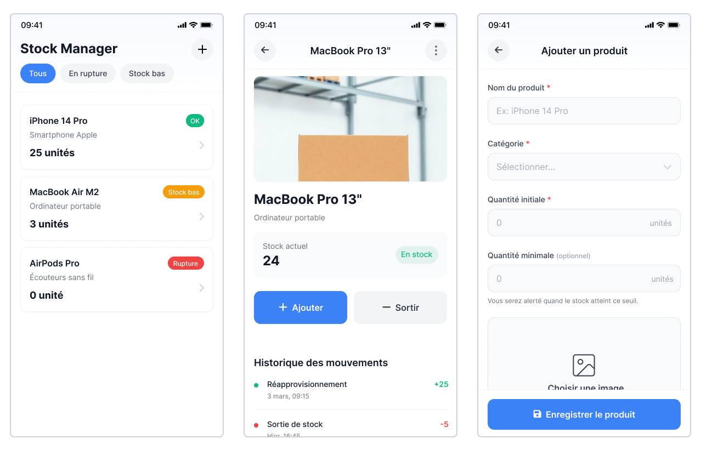

# Test technique - React Native



## Bienvenue 👋

L’objectif est simple : évaluer ta capacité à construire une application mobile en React Native, en utilisant Expo, en utilisant une API REST existante (déjà développée en Laravel).

Nous mettons à ta disposition une API de gestion de stock pour laquelle tu disposes d’un token d’accès, reçu dans le mail d'instructions.

👉 Ce test est conçu pour être réalisé en **3 heures maximum**.

👉 Une fois terminé, merci de le remettre dans un **dépôt GitHub privé** et de nous y inviter.

⚠️ Il n'est pas éliminatoire de ne pas terminer le test ; l'important est d'aller à ton rythme et de maintenir un code propre et maintenable tout au long du test.

💬 Le brief est volontairement concis et laisse des zones d'interprétation. Si un point te semble ambigu ou contradictoire, **écris-nous** : poser une bonne question est un signal positif, pas un aveu de faiblesse. Si tu préfères trancher seul, documente ton arbitrage dans `FEEDBACK.md`.

### Prérequis
- Node.js >= 18
- Expo CLI
- Un device ou émulateur iOS/Android

## Starter kit & Librairies conseillées

Pour gagner du temps, un **starter kit** vous est fourni avec :

- **[Maquettes Figma](https://www.figma.com/design/ngBgAcJCx8XOTdfyoGdvED/Stock-manager---Test-technique?node-id=4-471&t=dTgsItnlnDsvOMYX-1)**
- [Expo Router](https://docs.expo.dev/router/introduction/) pour la navigation
- [Tailwind](https://tailwindcss.com/) avec [twrnc](https://github.com/jaredh159/tailwind-react-native-classnames) pour le style
- [React Hook Form](https://react-hook-form.com/) pour les formulaires
- [Reanimated](https://docs.swmansion.com/react-native-reanimated/) pour les animations
- [React Query](https://tanstack.com/query/latest) pour les appels API
- [Zod](https://zod.dev/) pour les validations
- [Zustand](https://zustand-demo.pmnd.rs/) pour la gestion de state
- [Flash List](https://shopify.github.io/flash-list/) pour la gestion de listes
- [Action Sheet](https://github.com/expo/react-native-action-sheet) pour les actions contextuelles


👉 Vous êtes libre d’utiliser **les librairies de votre choix**, tant que l’architecture et les fonctionnalités demandées sont respectées.

## Brief

L'objectif de ce test est de produire une petite application permettant la gestion des stocks à l'aide de l'API.

- Liste de produits
  - Afficher tous les produits.
  - Afficher pour chaque produit : nom, catégorie, quantité, état (OK, Stock bas, Rupture).
  - Filtre sur le status (Tous, En rupture, Stock bas).
  - Bouton pour ajouter un produit.

- Écran Détail produit
  - Afficher les infos du produit (nom, categorie, quantité, image, status).
  - Liste des mouvements associés.
  - Boutons pour ajouter/sortir du stock.
  - Animation simple via Reanimated lors de la mise à jour de la quantité (bonus).
  - Suppression du produit

- Formulaire d’ajout / modification de produit
  - Champs : nom, catégorie, quantité initiale (cacher à l'édition), seuil minimum, image.
  - Validation des champs, gestion des erreurs.

- Alerte de seuil : lorsque le seuil minimum d'un produit est atteint, déclencher une notification locale.

PS : il n'est pas attendu d'implémenter un système d'authentification

## API

🔗 Base URL de l'API : 
```
https://technical-test-react-native-back-master-oibbvb.laravel.cloud/api
```

🔗 [Documentation Swagger](https://technical-test-react-native-back-master-oibbvb.laravel.cloud/api/swagger)

L’API utilise un token d’accès fourni (type Bearer).  
Chaque requête doit inclure le header suivant : `Authorization: Bearer <token>`


## Livrables attendus

- Repo GitHub privé contenant :
  - [FEEDBACK.md](http://FEEDBACK.md) (explications de l'architecture, des choix techniques, avis sur le test et commentaires).
  - Les modifications effectuées sur le code.
- Dans `FEEDBACK.md`, quelques lignes sur ton usage de l'IA : quels outils, et surtout **ce que tu as rejeté et pourquoi**. L'IA est autorisée et attendue ; ce qui nous intéresse est ton jugement sur ce qu'elle produit.
- Commits progressifs.
- Invitez-nous en tant que collaborateurs sur le dépôt privé.

## Critères d'évaluation

L'IA est autorisée et nous nous attendons à ce que tu l'utilises. Elle produira sans difficulté des écrans qui fonctionnent : ce n'est donc pas là que se joue l'évaluation. Nous attachons une attention particulière à la **structure du code**, à la **robustesse** (garde-fous, comportement dans les cas limites) et à l'**UX**.

Sur l'UX, une précision : nous parlons du comportement, pas de l'esthétique. Le rendu visuel est le métier de nos designers, et reste largement subjectif — inutile de passer une heure à reproduire la maquette au pixel. Ce qui nous intéresse, c'est ce que vit l'utilisateur : ce qui se passe pendant un chargement, quand une action échoue, quand une liste est vide, quand le réseau est mauvais.

- Qualité et structure du code React Native.
- Gestion correcte des appels API (erreurs, loading, retry éventuel).
- Respect des règles métier.
- Robustesse : edge cases, états intermédiaires et garde-fous, pas seulement le happy path.
- Cohérence UX et finitions (insets, haptic, ...).
- État vide / skeleton loaders soignés.
- Bonus : une petite animation, librairie i18n, tests unitaires ou d’intégration (Jest/RTL).

## Getting Started

1. Cloner le repo :
   ```bash
   git clone https://github.com/YieldStudio/technical-test-react-native.git
   cd technical-test-react-native
   ```
2. Lancer le projet :
   ```bash
   npm install
   npm run start
   ```
3. Commencer à implémenter les fonctionnalités demandées.
4. Créer un **dépôt privé** sur GitHub depuis votre compte.
5. Changer l’origine Git pour pointer vers votre dépôt privé :
   ```bash
   git remote remove origin
   git remote add origin git@github.com:<votre-compte>/<votre-repo-prive>.git
   ```
6. Pousser votre travail :
   ```bash
   git push -u origin main
   ```
7. Invitez-nous en tant que collaborateurs sur ce dépôt privé (vous recevrez nos identifiants GitHub par email).
